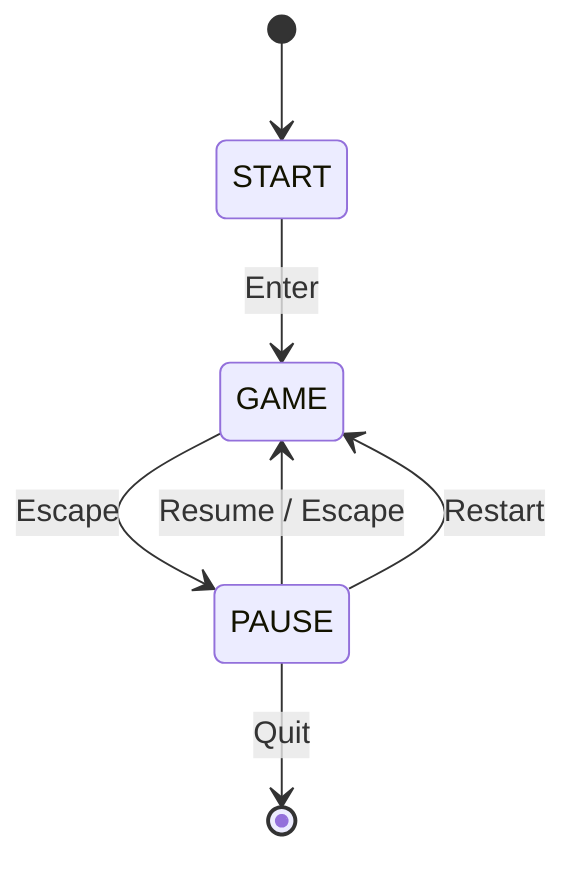

# GameEngineBase

<p align="center">
  
  <a href="https://pypi.org/project/pygame-ce/">
    
  </a>
  
  
</p>

A minimal Python game engine built with **Pygame Community Edition (pygame-ce)**, designed as a base for small 2D games.
Includes a **state machine**, **entity system**, and **menu abstraction**, allowing rapid prototyping and iteration.

---

## Features

* **State management:** START, GAME, PAUSE, GAMEOVER
* **Menu support:** Start screen and pause menu with selectable options
* **Entity lifecycle:** Entities can be killed (`alive` / `kill()`), automatically removed from the game loop
* **Frame-independent movement:** `dt` (delta time) for smooth motion
* **Modular architecture:** Menus and game logic are separated
* **Explicit engine boundaries:** Public API vs internal engine methods
* **Safe development environment:** Always use a virtual environment to avoid polluting system Python

---

## Requirements

* Python 3.11+
* [Pygame Community Edition](https://pypi.org/project/pygame-ce/)

---

## File Structure

```

GameEngineBase/
│
├── config.py        # Window settings, FPS, and game states
├── entity.py        # Base Entity class
├── game.py          # Core game engine
├── main.py          # Entry point
├── player.py        # Player entity
├── pause.py         # Pause menu
├── start.py         # Start menu
├── requirements.txt # Dependencies
├── Makefile         # Setup and run shortcuts

````

---

## How to Run

### Using the Makefile (recommended)

```bash
make setup   # creates venv and installs dependencies
make run     # runs the game inside the venv
````

### Manual Setup (if not using Makefile)

Since the virtual environment is **not included** in the repository, it must be created manually:

```bash
python3 -m venv venv        # create virtual environment
source venv/bin/activate   # activate environment
pip install --upgrade pip
pip install -r requirements.txt
python main.py
```

> Always run the game inside the **venv** to avoid conflicts with system Python packages.

---

## Controls

* **Start Screen:** Press **Enter** to start the game
* **Pause Menu:** Press **Escape** during gameplay

  * Navigate with **Up/Down arrows**
  * Press **Enter** to select:

    * Resume
    * Restart
    * Quit
* **Player Movement:** WASD keys

---

## Game Class

**`Game`**

The central engine object. This class owns the game loop, state machine, entity lifecycle, and menu coordination.

The public surface of the engine is intentionally small; most logic is handled by private internal methods.

### Responsibilities

* Initializes Pygame and configures the display
* Maintains the **game state machine** (`GameState`)
* Manages **entity update and draw cycles**
* Routes input to the correct system based on state
* Coordinates **StartMenu** and **PauseMenu**
* Ensures clean shutdown of Pygame

### Public Methods

* `run()` — starts and maintains the main game loop
* `close()` — shuts down Pygame cleanly

### Internal (Private) Methods

* `_get_events()` — polls and dispatches Pygame events

* `_handle_keydown(key)`
  Handles keyboard input based on the current game state.

* `_update()`
  Updates all alive entities and removes dead ones from the game.

* `_draw()`
  Draws all active entities to the screen.

* `_restart()`
  Resets the game by killing existing entities and spawning a fresh player.

These methods are intentionally private to enforce a clear separation between the **engine interface** and **engine internals**.

---

## Game State Flow



---

## Main Loop Execution

```mermaid
flowchart TD
    A[Game.run()] --> B[Clock tick / dt]
    B --> C[_get_events()]
    C --> D{GameState}
    D -->|START| E[StartMenu.update/draw]
    D -->|GAME| F[_update + _draw]
    D -->|PAUSE| G[_draw + PauseMenu]
    E --> H[pygame.display.flip]
    F --> H
    G --> H
```

---

## Menus

### `StartMenu`

* Displays “Press [Enter] to start”
* Stateless and lightweight

**Methods:**

* `update(dt)` — placeholder for future logic
* `draw(screen)` — renders the start screen

### `PauseMenu`

* Displays selectable options:

  * Resume
  * Restart
  * Quit Game
* Highlights the current selection
* Uses `pygame.key.get_just_pressed()` for clean input handling

**Methods:**

* `update(dt)` — handles menu navigation
* `draw(screen)` — draws overlay and menu options

---

## Entities

### `Entity`

Base class for all game objects.

**Responsibilities:**

* `update(dt)` — update object state
* `draw(screen)` — render object
* `kill()` — mark entity as dead (`alive = False`)

### `Player`

* Subclass of `Entity`
* Handles movement using **WASD**
* Movement is frame-rate independent via delta time
* Implements `kill()` to integrate with the entity lifecycle

---

## Entity Lifecycle

The engine uses a **kill-and-sweep** pattern:

```python
entity.kill()   # marks entity as dead
```

Dead entities are removed automatically during `_update()`:

```python
self.game_entities = [e for e in self.game_entities if e.alive]
```

**Why this works well:**

* No mutation of lists during iteration
* Clean restart logic
* Scales naturally to enemies, bullets, effects, etc.

---

## Extending the Engine

### Adding Entities

* Subclass `Entity`
* Implement `update()` and `draw()`
* Append to `game_entities`

### Adding States

* Extend `GameState` in `config.py`
* Handle the new state inside `Game.run()`

### Adding Pause Menu Actions

* Extend `PauseMenu.options`
* Add behavior in `_handle_keydown()`

### Restart Logic

* Centralized in `_restart()`
* Easy to expand for score resets, level reloads, etc.

---

## Makefile Targets

* `make setup` — create virtual environment and install dependencies
* `make run` — run the game inside the virtual environment
* `make clean` — remove `__pycache__` and the virtual environment

---

## Future Improvements

* Implement **GAMEOVER** state and menu
* Scene / level system
* Collision handling
* Audio system
* Save/load support

---

## AI Usage

AI usage is limited to the following within this project:

* `README.md` (ChatGPT)

All engine code and architecture were implemented manually.
